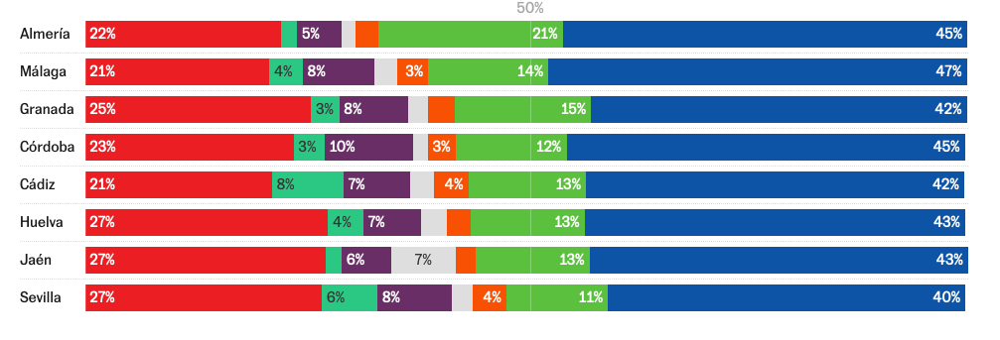

Ejercicio 1.- A partir del dataset del Ayuntamiento de Madrid sobre tipos de salidas, haz un gráfico de barras en el que se observen los principales motivos. 
```{r}

library(tidyverse)
library(here)

url_all <- "https://raw.githubusercontent.com/borjandrinot/visualizacion-uc3m-2023/main/data_raw/data_bomberos_all.csv"

url_long <- "https://raw.githubusercontent.com/borjandrinot/visualizacion-uc3m-2023/main/data_raw/data_bomberos_long.csv"

url_monthly <- "https://raw.githubusercontent.com/borjandrinot/visualizacion-uc3m-2023/main/data_raw/data_bomberos_monthly.csv"

data_bomberos_all <- read_csv(url_all)
data_bomberos_long <- read_csv(url_long)
data_bomberos_monthly <- read_csv(url_monthly)
  

ggplot(data_bomberos_all) + 
  geom_col(aes(x = tipo_salida, y = salidas)) +
  coord_flip() +
  theme_minimal()

```


Ejercicio 2.- Añade color a la visualización para resaltar los tipos de salidas con mayor incidencia
```{r}

ggplot(data_bomberos_all) + 
  geom_col(aes(x = tipo_salida, y = salidas, 
               fill = salidas), 
           color = "black", size = 0.3, width = 0.5) +
  coord_flip() +
  theme_minimal()

```

Ejercicio 3.- A partir del dataset de salidas mensuales por tipo de salida, haz un gráfico que represente la evolución mensual de estos datos
```{r}

ggplot(data_bomberos_monthly) +
  geom_line(aes(x = date, y = salidas, color = tipo_salida), 
            size = 1) + 
  scale_color_manual(values = c("danos_en_construccion" = "grey",
                                "danos_por_agua" = "grey",
                                "fuegos" = "darkred",
                                "incidentes_diversos" = "grey",
                                "salidas_sin_intervencion" = "darkblue",
                                "salvamentos_y_rescates" = "grey",
                                "servicios_varios" = "grey")) +
  theme_minimal()

```

Ejercicio 4.- Utiliza alguno de los parámetros del aesthetics para destacar dos tipos de salida y escribe un párrafo contando qué te llama la atención de ellos.
```{r}

```


Ejercicio 5.- Intenta hacer el gráfico anterior, pero ahora con una interpolación por pasos. Además, añádele puntos en cada paso para observar mejor cada mes. 
```{r}

```

Ejercicio 6.- Representa en un gráfico el resultado total de las elecciones de Andalucía. ¿Puedes colorear por cada partido?

```{r}

```


Ejercicio 7.- Intenta replicar este gráfico a partir de los datasets que hemos adjuntado para esta práctica.


```{r}

```


Ejercicio 8.- Realiza este mismo gráfico para tipo de municipio. 
```{r}

```


Ejercicio 9.- Con los datos del ejercicio anterior busca otro tipo de gráfico para representar el voto por tipo de municipio para cada partido
```{r}

```


Ejercicio 10.- A partir de los datos por municipio de las últimas elecciones de Castilla y León elige un gráfico y escribe un párrafo con alguna cuestión interesante que observes en él. 
```{r}

```

